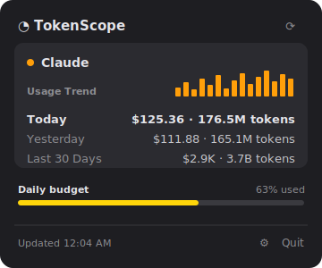

# TokenScope

A macOS **menu-bar app + desktop widget** that tracks your AI coding token usage
in detail — modeled on the reference "usage" menu-bar apps. It reads your
**local Claude Code logs** (and, experimentally, Codex CLI logs), prices every
message, and shows Today / Yesterday / Last-30-days spend plus a 30-day trend.

Everything runs **locally**. No API keys, no network calls, no data leaves your Mac.



---

## Why it works this way

Claude Code writes a JSONL transcript for every session under
`~/.claude/projects/**/*.jsonl`. Each assistant turn carries a `usage` block:

```json
{"type":"assistant","timestamp":"2025-06-30T12:34:56.789Z","requestId":"req_…",
 "message":{"id":"msg_…","model":"claude-opus-4-20250514",
   "usage":{"input_tokens":4,"output_tokens":250,
            "cache_creation_input_tokens":12000,"cache_read_input_tokens":20000}}}
```

TokenScope streams those files, de-duplicates replayed turns (by
`message.id` + `requestId`), multiplies each token bucket by the model's list
price, and buckets the results by local calendar day. This is the same approach
the `ccusage` CLI uses — the numbers are an **estimate from list prices**, not a
bill from Anthropic.

---

## Layout

```
TokenScope/
├── Packages/UsageCore/        # ← all parsing/pricing logic, no UI. Pure Swift, unit-tested.
│   ├── Sources/UsageCore/     #   Models, PricingTable, Claude/Codex parsers, aggregator
│   ├── Sources/usagescope/    #   `usagescope` CLI — verify numbers without Xcode
│   └── Tests/UsageCoreTests/  #   `swift test`
├── App/                       # SwiftUI MenuBarExtra app
├── Widget/                    # WidgetKit extension (small + medium)
├── Shared/                    # SharedUsageStore — app ↔ widget bridge (App Group)
└── project.yml                # XcodeGen spec → TokenScope.xcodeproj
```

The design rule: **all logic lives in `UsageCore`** so it can be tested on any
machine; the app and widget are thin views over it.

---

## Quick start

### 1. Verify the numbers first (no Xcode needed)

```bash
cd TokenScope/Packages/UsageCore
swift test          # runs the unit tests
swift run usagescope        # prints your real Today/Yesterday/30-day totals
swift run usagescope --json # machine-readable snapshot
```

If `usagescope` shows sensible numbers, the app will too.

### 2. Build the menu-bar app (default)

Requires **Xcode 15+** on macOS 14+.

```bash
brew install xcodegen
cd TokenScope
xcodegen generate          # creates TokenScope.xcodeproj
open TokenScope.xcodeproj
```

In Xcode:

1. Select the **TokenScope** target → *Signing & Capabilities* → pick your Team
   (a **free Apple ID works** — the default build needs no special capabilities).
2. Press ▶︎ Run. The gauge appears in your menu bar.

That's it. No App Group, no paid account needed for the menu-bar app.

> **Signing note:** the app is intentionally **not sandboxed** so it can read
> `~/.claude`. If Xcode complains the bundle id is taken, change
> `bundleIdPrefix` in `project.yml` to something personal (e.g. `com.yourname`)
> and rerun `xcodegen generate`.

### 3. (Optional) Add the desktop widget

The widget needs an **App Group**, which requires a **paid Apple Developer
account**. To enable it:

1. In `project.yml`, uncomment `- target: TokenScopeWidget` under the app target.
2. Change the app's `CODE_SIGN_ENTITLEMENTS` to `App/TokenScopeWithWidget.entitlements`.
3. `xcodegen generate`, open the project, set your Team on **both** targets, Run.
4. Add the widget from the desktop *Edit Widgets* gallery.

---

## Configuration

| What | How |
|------|-----|
| **Daily budget meter** | Set a dollar amount in the app's Settings (gear icon). `0` hides it. |
| **Menu-bar provider** | Settings → segmented picker (Claude / Codex). |
| **Custom prices** | Drop a JSON file at `~/.config/tokenscope/pricing.json`, e.g. `{"opus":{"inputPerMTok":15,"outputPerMTok":75,"cacheWritePerMTok":18.75,"cacheReadPerMTok":1.5}}`. Keys match model-id substrings. |
| **Codex tracking** | Auto-enabled when `~/.codex/sessions` exists. CLI: `--codex-dir PATH`. |

Prices in `PricingTable.default` are Anthropic/OpenAI list prices at time of
writing — update them there or via the override file as prices change.

---

## Caveats

- **Estimates, not invoices.** Cost is computed from list prices; your actual
  bill (or Max/Pro subscription) may differ. Subscription plans aren't billed
  per token at all — treat the dollar figure as "equivalent API value".
- **Codex parsing is experimental.** The Codex CLI log schema is undocumented
  and shifts between releases. If Codex numbers look wrong, adjust
  `CodexLogParser.record(from:)` — the field names are all in one place.
- **Rate-limit rings** (the Session/Weekly % bars in some apps) aren't shown:
  that data isn't in the local logs. TokenScope shows what the logs actually
  contain plus an optional self-set budget meter.

---

## Development

```bash
cd Packages/UsageCore && swift test      # logic tests
xcodegen generate                        # regenerate project after adding files
```

The `.xcodeproj` is generated and git-ignored — edit `project.yml` and rerun
`xcodegen generate` when you add targets or files.
